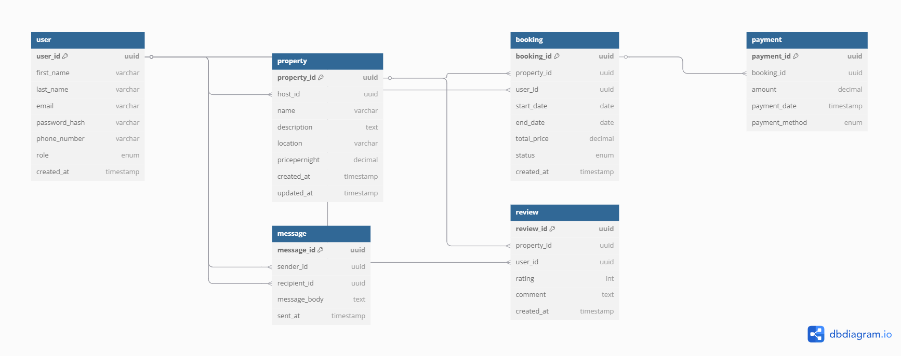

# Entities and Attributes

## User

    user_id: Primary Key, UUID, Indexed
    first_name: VARCHAR, NOT NULL
    last_name: VARCHAR, NOT NULL
    email: VARCHAR, UNIQUE, NOT NULL
    password_hash: VARCHAR, NOT NULL
    phone_number: VARCHAR, NULL
    role: ENUM (guest, host, admin), NOT NULL
    created_at: TIMESTAMP, DEFAULT CURRENT_TIMESTAMP

## Property

    property_id: Primary Key, UUID, Indexed
    host_id: Foreign Key, references User(user_id)
    name: VARCHAR, NOT NULL
    description: TEXT, NOT NULL
    location: VARCHAR, NOT NULL
    pricepernight: DECIMAL, NOT NULL
    created_at: TIMESTAMP, DEFAULT CURRENT_TIMESTAMP
    updated_at: TIMESTAMP, ON UPDATE CURRENT_TIMESTAMP

## Booking

    booking_id: Primary Key, UUID, Indexed
    property_id: Foreign Key, references Property(property_id)
    user_id: Foreign Key, references User(user_id)
    start_date: DATE, NOT NULL
    end_date: DATE, NOT NULL
    total_price: DECIMAL, NOT NULL
    status: ENUM (pending, confirmed, canceled), NOT NULL
    created_at: TIMESTAMP, DEFAULT CURRENT_TIMESTAMP

## Payment

    payment_id: Primary Key, UUID, Indexed
    booking_id: Foreign Key, references Booking(booking_id)
    amount: DECIMAL, NOT NULL
    payment_date: TIMESTAMP, DEFAULT CURRENT_TIMESTAMP
    payment_method: ENUM (credit_card, paypal, stripe), NOT NULL

## Review

    review_id: Primary Key, UUID, Indexed
    property_id: Foreign Key, references Property(property_id)
    user_id: Foreign Key, references User(user_id)
    rating: INTEGER, CHECK: rating >= 1 AND rating <= 5, NOT NULL
    comment: TEXT, NOT NULL
    created_at: TIMESTAMP, DEFAULT CURRENT_TIMESTAMP

## Message

    message_id: Primary Key, UUID, Indexed
    sender_id: Foreign Key, references User(user_id)
    recipient_id: Foreign Key, references User(user_id)
    message_body: TEXT, NOT NULL
    sent_at: TIMESTAMP, DEFAULT CURRENT_TIMESTAMP

# Relationships Between Entities

## User

    - can have multiple properties (as host)
    - can make multiple bookings (as guest)
    - can write multiple reviews
    - can send and receive multiple messages

## Property

    - belongs to one user (host)
    - can have multiple bookings
    - can have multiple reviews

## Booking

    - belongs to one user (guest)
    - belongs to one property
    - can have at most one payment

## Payment

    - belongs to one booking

## Review

    - belongs to one user
    - belongs to one property

## Message

    - belongs to one sender (user)
    - belongs to one recipient (user)

# ER-diagram

This ER diagram was generated using dbdiagram.io based on the defined schema. It clearly shows entity relationships, including multiple user roles (host, guest, reviewer, messenger) and transactional links (bookings, payments, reviews, messages).

