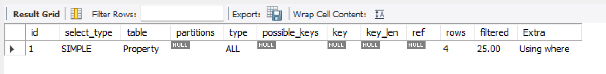
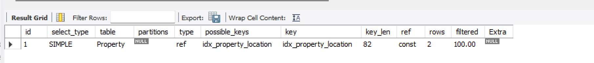
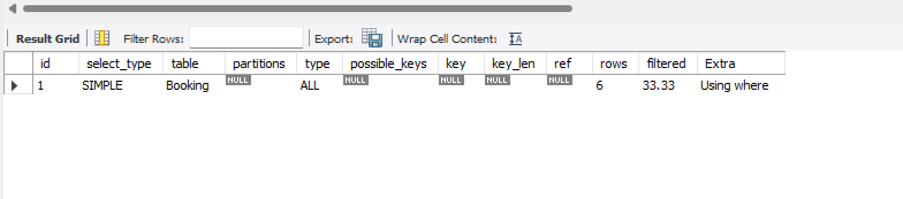
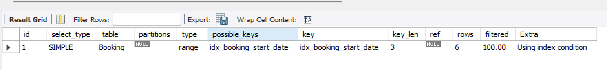

# 📄 Indexing Report

## ✅ Columns chosen for indexing

### User table

- `email`
- `id`

### Property table

- `id`
- `name`
- `location`

### Booking table

- `id`
- `start_date`

I chose these columns because they are frequently used in operations such as `JOIN`, `WHERE`, and `ORDER BY`.

---

## 🔧 Index creation

- For `id` and `email`, I do not have to create indexes manually since they are already indexed by default (as primary keys or unique constraints).

- For the other columns, I used the following commands to create indexes:

```sql
CREATE INDEX idx_property_name ON Property(name);
CREATE INDEX idx_property_location ON Property(location);
CREATE INDEX idx_booking_start_date ON Booking(start_date);

```

## 🚀 Performance measurement

I measured the query performance using the `EXPLAIN` statement before and after adding indexes.

### 🔎 Key observations

- The **key** column in the execution plan started showing the index names for each table after adding the indexes.
- The **type** changed from `ALL` (full table scan) to more efficient types such as `ref` and `range`.
- The number of **rows** scanned was reduced, improving performance.

---

### 📸 Example: Query on `Property.location`

#### Before adding index



#### After adding index



---

### 📸 Example: Query on `Booking.start_date`

#### Before adding index



#### After adding index



---
```
